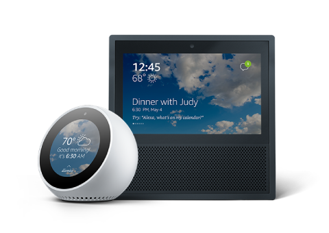
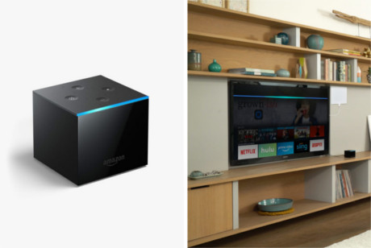

# Let's build an Alaxa Skill in Go!

by: Daniel Toebe

---

## Who am I

I am a back-end software developer/engineer. I work at GPS Insight. In my day to day work I work with Go creating micro services, and tools to solve real problems. Due to Go's simple... Well everything...

- I and a whole community of very talented developers have been able to develop massive and complex systems.
- This allows us to deploy with 0 downtime multiple times a day.
- Create complex webs of micro services, and monitor them.
- And so much more...

---

## What we will be going over

- The Amazon Alexa ecosystem
- Creating a basic Lambda function in Go
- Writing a custom Alexa Skill
- Setting up the Lambda to work with the Alexa skill
- Testing your new Alexa skill
- Going forward ...

---

# The Amazon Alexa Ecosystem

---

## What is an Alexa Skill

- An Alexa Skill is an application that works inside the Amazon Alexa Ecosystem
- That Ecosystem is primarily voice, but as it grows we will see more visual as well.

---

## Who uses Alexa Skills

**People from every walk of life use Alexa**

- From little children getting a bedtime story
- To people getting time and weather
- To anybody getting News briefings in the morning to listening to music or audiobooks in the evening
- Controlling smart devices, such as lights and thermostats with your voice
- Even making video calls, announcements, or voice messages to your family, and friends

---

# Alexa uses and places

---

## The Echo and Echo Dot


_src: [Amazon](https://developer.amazon.com/echo)_

---

## The Echo Spot, and Echo Show with small screens


_src: [Amazon](https://developer.amazon.com/echo-show)_

---

## Now the Echo Cube, which will learn to control your TV.


_src: [gearpatrol.com](https://gearpatrol.com/2018/06/07/amazon-fire-tv-cube-first-look/)_

- With things like Tuning it on or off, adjusting the volume, even searching and starting shows... All with your voice
- Such as "Alexa play Lucifer", and it will open Hulu and stat playing where you left off

---

##  Mariott hotels

Mariott Hotels recently announced a deal with Amazon to place Alexa Skills in their hotels to order room service and ect...

---

## Monetization

You can make money by creating skills with in-app purchases, or account linking

- E-commerce
- Chat and alert apps
- So much more...

---

## Questions?

---

# Let's build something!

---

## Starting with a simple Lambda function

We will build a function that will take a planet name and return a random fact about that planet

---

## What is a Lambda function

- In this case, just like in mathematics. A Lambda function is an anonymous function that take an input and returns an output.
- While we say function, what we really mean is a small single purpose application.
- Probably smaller than a single architectural domain.
- Expect a cold startup of the application on every use so it needs to be small and fast

---

## Why Go

Why Go over any of the other languages?

- Well you're at this Meetup so I assume you prefer Go
- We will compile the code to a small binary, so it will be faster than say NodeJS or Java
- It's FUN!!

---

## The Data

```
"A year on Mercury is just 88 days long.",
"Despite being farther from the Sun, Venus experiences higher
        temperatures than Mercury.",
"Venus rotates counter-clockwise, possibly because of a collision
        in the past with an asteroid.",
"On Mars, the Sun appears about half the size as it does on Earth.",
"Earth is the only planet not named after a god.",
"Jupiter has the shortest day of all the planets.",
"The Sun contains 99.86%% of the mass in the Solar System.",
"The Sun is an almost perfect sphere.",
"The temperature inside the Sun can reach 15 million degrees
        Celsius.",
"Saturn radiates two and a half times more energy into space
        than it receives from the sun.",
"The Moon is moving approximately 3.8 cm away from our planet
        every year.",
```

---

## The data (cont...)

We will put this into a `map[string][]string`

- The keys will be the planet names Example: `"mars"`, or `"venus"`
- The string slices will hold the facts. Note that the length of the slices are different from planet to planet

_code: ./lambda/lambda.go_

---

## The logic

Here we create a function that will
- Receive a payload containing a planet name as a `string`
- Take that string as a key to the map I showed you previously and pick a random `string` from the `[]string`
- If there is no planet provided it will then pick a random planet and then pick a random fact in the slice
- Finally if the payload is malformed in any way, or if there are any panics, the lambda will return an error

_code: ./lambda/lambda.go_

---

## The AWS Lambda Go Library

`github.com/aws/aws-lambda-go/lambda`

This is officially from Amazon. And really very simple.

- Here all we do is add `lamda.Start(<function_name>)` in the `main()` function
- And the `<function_name>` parameters we the `struct` (or could be map), that the Lambda SDK can decode from JSON
- The Lambda lib will handle encoding and decoding

_code: ./lambda/lambda.go_

---

## Deploying the Lambda

We will deploy from the AWS CLI tool. So you will have to already logged in.

Build the Go binary. Make sure you build it for Linux/AMD64

```bash
env GOOS=linux GOARCH=amd64 \
go build -o $(pwd)/code/lambda/planets \
$(pwd)/code/lambda/lambda.go
```

Zip it up. Note, that the binary needs to be at the root of the zip so I use the `-j` flag

```bash
zip -j $(pwd)/code/lambda/planets.zip $(pwd)/code/lambda/planets
```

---

## Deploying the Lambda (cont...)

Create an AWS IAM role just for this function, for security. Remember the ARN created for when we deploy the function itself

```bash
aws iam create-role --role-name lambda-planets-executor \
--assume-role-policy-document \
file://$(pwd)/code/lambda/trust-policy.json
```
  _code: lambda/trust-policy.json_

Give that role simple Lambda Execution Permissions

```bash
aws iam attach-role-policy --role-name lambda-planets-executor \
--policy-arn \
arn:aws:iam::aws:policy/service-role/AWSLambdaBasicExecutionRole
```

Now lets create the function and deploy

```bash
aws lambda create-function --function-name planets \
--runtime go1.x --role ${ARN} --handler planets \
--zip-file fileb://$(pwd)/code/lambda/planets.zip
```

---

## Testing the Lambda

These are not normal HTTP rest endpoints, and need to be accessed from within the AWS ecosystem. So well use the AWS CLI to test

```bash
aws lambda invoke --function-name planets \
--payload '{"planet": "sun"}' /tmp/planets-output.json

aws lambda invoke --function-name planets \
--payload '{"planet": ""}' /tmp/planets-output.json

aws lambda invoke --function-name planets /tmp/planets-output.json
```

---

## Questions?

---

# Let's build the Alexa Skill

---

## Creating the Skill in the Alexa Skill Console

- You might have to create an Alexa account.
- Go to: [Alexa Console Home](https://developer.amazon.com/alexa/console/ask?)
- Click the "Create Skill" button
- Enter the name. Note, the name is not the name of the Invocation, it's just the name in you system
- Make sure "Custom" is selected, and click "Create a skill"

---

## Now that the Skill is created

- Click into "Invocation" on the left pane
- Give your skill a name that users will use. In this case: `planet gopher`. Click "Save Model"

---

## Intents

Intents are how your users will interact with your skill

- So when a user says "ask planet gopher to give me a random fact" this is where we define that.

I have prepared the JSON for this.

_code: skill/intents.json_

---

## Let's go over the terminology

- Intents Array: An array of objects that give
        - An Intent name: sent to the lambda and helps choose which
          logic to process
        - A Slot: a refrence to a list of types for variable names to
          be sent over to the function
        - Samples: are example phrases that can be used by the user.
        - The Alexa system will be "intelligent" on additional words
          added when a user says an Invokation
          (Example words "to", "when", ect...)
        - You see the "{PlanetName}" in the samples string.
          This maps to the slot
- The types Array: An array of objects that maps to an Intents.slots, for possible variables

Docs: https://developer.amazon.com/docs/smapi/interaction-model-schema.html

_code: skill/intents.json_

---

## Questions?

---

## Now for the Lambda function

Currently there is not an official Alexa Skill SDK for Go

There are a few third party libraries already created.

- I picked: https://github.com/arienmalec/alexa-go
- I like this on because if how simple it is. It's mainly a collection of structs and defaults, with few functions and methods
- Because we are really just building a Lambda function that just accepts a specific payload and outputs a specific payload.

---

## The code

This will look a little different than the first function we created.

_code: skill/lambda-skill.go_

---

## Let's deploy it

Really this is the same as the previous function, so I'll do this quickly.

_code: skill/cmd.go_

---

## Updating the function

Since we are using static data compiled in the binary if we want to add more data we need to re-compile and re-deploy the function

```bash
aws lambda update-function-code --function-name planet-gopher \
--zip-file fileb://$(pwd)/code/skill/planets-skill.zip
```

---

## Connecting the Skill to the Lambda

- In the Alexa console click "endpoint" on the left pane.
- Select "AWS Lambda ARN".
- Copy the "Your Skill ID"
- Now Go to the AWS console and under services Search for "lambda": https://aws.amazon.com/console/
- Select the created function. In this case planet-gopher
- In Configuration, under Add Triggers, select Alexa Skills Kit
- In the card below paste the skill ID
- Now in the upper right corner you will see your function's ARN. Copy that
- Go back to the Alexa console and paste the Lambda's ARN in the "Default Region" input
- Click "Save Endpoint"

---

## Questions?

---

# Testing the skill

---

## FIRST!

This one caught me up for a while.

After any changes made in you skill, it needs to be rebuilt

- Click "CUSTOM" in the left pane
- Click "3. Build Model >"
- This will trigger a build of your skill.

**If you do not do this, your changes will not be reflected when you test.**

---

## Running Tests

In the Alexa console, on the top menu select "Test"

Here you will see a few things
- An input with the microphone icon
        - This is where you will either type or say your command
        - We'll type "ask planet gopher to pick a random planet"
        - Now we'll click the icon and say
                "ask planet gopher to select sun"
- With these inputs we will see the
        - JSON Skill O/I
        - What users will See on the Echo Show
                (and Cube from your TV), and spot

---

## Questions?

---

## Going forward

There is a lot we didn't go over

- Dialogs: Conversations with back and forth with Alexa
- Integrating with other AWS systems
- HTTP(S) Lambda endpoints
- So much more...

But there is great documentation on all of that
- Alexa Skills: https://developer.amazon.com/alexa
- Lambda: https://aws.amazon.com/documentation/lambda/

---

## Thank you

Daniel Toebe

Twitter: @dtoebe

Blog: dtoebe.com

